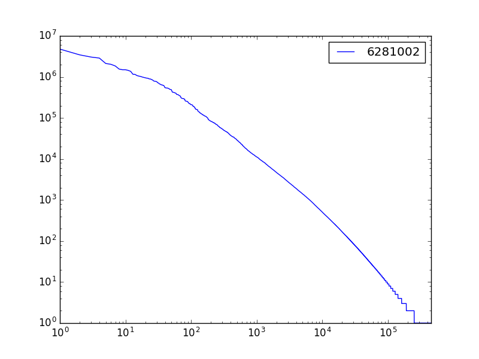
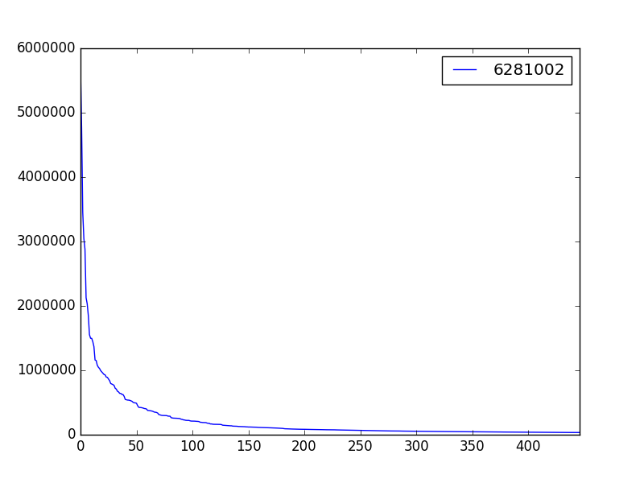
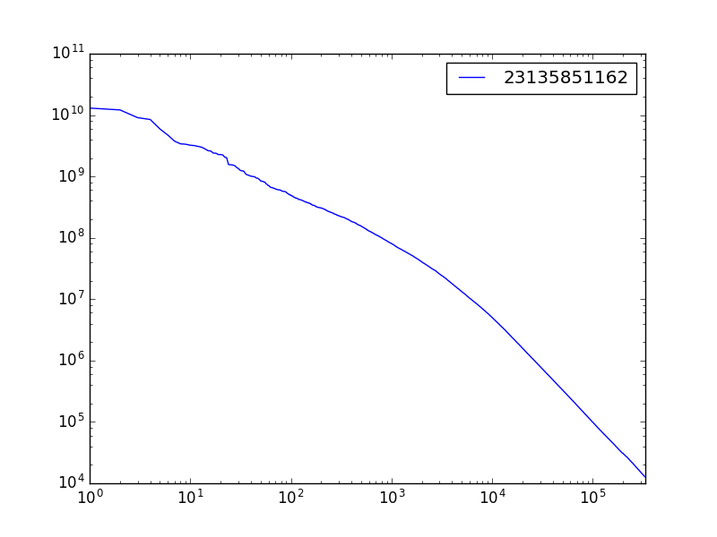
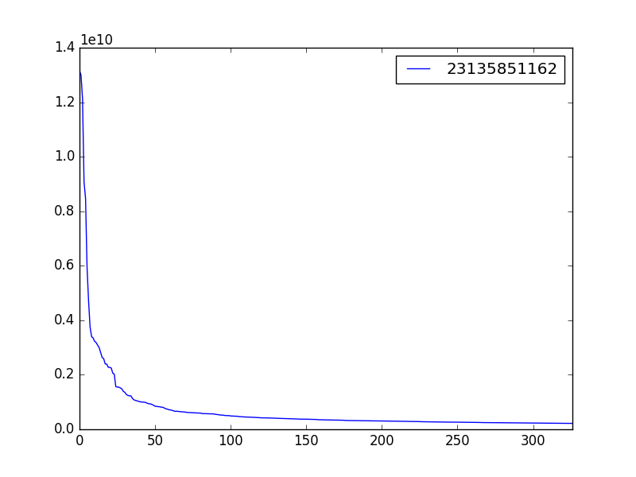

# anagram-frequency

I plotted log-log and small sample of first and second column.

English word distribution roughly follows a Zipf distribution.

<http://www.intmath.com/exponential-logarithmic-functions/7-graphs-log-semilog.php#zipf>

<https://en.wikipedia.org/wiki/Zipf%27s_law>

Here are samples of word frequency:

Words sorted shortest first, then most anagrams second.

## Estimating difficulty from length and frequency

A longer word has more permutations.

A rarer word is less likely to be considered.

The rarity has a Zipf distribution.

Permutations have a factorial distribution.

To estimate difficulty of solving an anagram, these metrics can be composited together.

        >>> from anagram_difficulty import *
        >>> tabulate_file('test_word_list.csv', 'test_frequency.txt')
        'test_word_list.difficulty.csv'

For compatibility with the existing files as in this example file, `tabulate_file` expects header of `word` in the list file, but no header for frequency file.

Example usage from the command line:

        python anagram_difficulty.py sample_word_list.csv en.txt

This appends frequency as seen in the test file.

# Tabulating

The main program reads cached table if it exists and revises weights.

        >>> from anagram_frequency import *
        >>> main()

It creates a list of single words,
sorted shortest first, most anagrams second.

        >>> words = read_first_words('test_word_list.txt')
        >>> table = to_table(words, 2, 3)
        >>> print(to_text(table))
        word_length,anagram_count,words
        3,3,ATE,EAT,TEA
        3,2,BAT,TAB
        4,2,RATE,TEAR
        5,4,ROUST,ROUTS,STOUR,TROUS
        5,2,PRICE,RECIP

Sort table by sum of word frequency percentiles
weighted with word length.

        >>> frequencies = read_first_words('test_frequency.txt')
        >>> len(frequencies)
        10
        >>> frequencies[0]
        'PRICE'
        >>> frequencies_1 = read_first_words('test_frequency_1.txt')
        >>> frequencies_list = [frequencies, frequencies_1]
        >>> table = sort_short_and_frequent(table, frequencies_list)
        >>> print(to_text(table))
        word_length,anagram_count,words_frequencies
        3,3,EAT,90,TEA,80,ATE,10
        3,2,TAB,60,BAT,50
        4,2,RATE,60,TEAR,30
        5,2,PRICE,50,RECIP,20
        5,4,STOUR,10,ROUST,0,ROUTS,0,TROUS,0

Extract first words.

        >>> print(to_first_word_text(table))
        EAT
        TAB
        RATE
        PRICE
        STOUR

First word in table:

        >>> table = [('word_length', 'words'), 
        ...     [3, 'ATE', 10, 'EAT', 5], 
        ...     [4, 'RATE', 5, 'TEAR', 2]]
        >>> print(to_first_word_text(table))
        ATE
        RATE

Optionally, exclude words from first appearance.  This is useful to not list a word that ruffles the feathers of prudes.

        >>> excludes = ['ATE', 'TEAR']
        >>> print(to_first_word_text(table, excludes))
        EAT
        RATE

Credits
=======

TWL06.txt tournament word list, and count\_1w.txt copied from Peter Norvig:   http://norvig.com/ngrams/
See their copyrights.

en.txt frequency word list compiled from open subtitles 2012 by Hermit Dave and is licensed:
"Creative Commons – Attribution / ShareAlike 3.0 license applies to the use of the word lists."
https://invokeit.wordpress.com/frequency-word-lists

Here are related algorithms to find anagrams:

<http://rosettacode.org/wiki/Anagrams#Python>

<http://stackoverflow.com/questions/6555046/how-can-i-speed-up-this-anagram-algorithm>

<http://interactivepython.org/runestone/static/pythonds/AlgorithmAnalysis/AnAnagramDetectionExample.html>

<http://codereview.stackexchange.com/questions/75023/optimizing-an-anagram-solver?newreg=4ad79b0c1ffc4775a3dd8af1559f3a79>

<https://blogs.msdn.microsoft.com/ericlippert/2009/02/04/a-nasality-talisman-for-the-sultana-analyst/>
